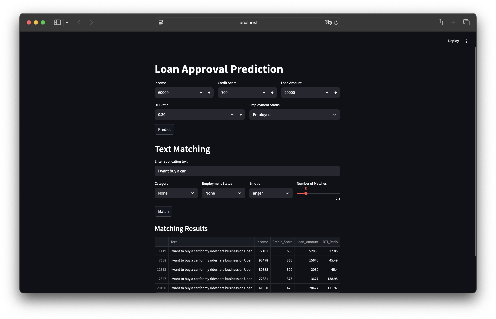

## 基于AI的贷款需求匹配与审批预测的应用工具
🔍 通过自然语言描述精准定位相似贷款需求，结合多维金融特征分析，为用户智能评估贷款可行性并提供预测建议。

### 核心功能
* 语义搜索：输入贷款申请描述 → 基于智谱AI的text-embedding模型构建向量数据库，实时匹配历史相似需求
* 风险画像：综合分析年收入、信用评分、债务收入比、就业状态等关键特征，呈现贷款审批类似案例
* 智能预测：调用Hugging Face金融领域预训练模型，输出审批概率与建议额度

### 项目展示

